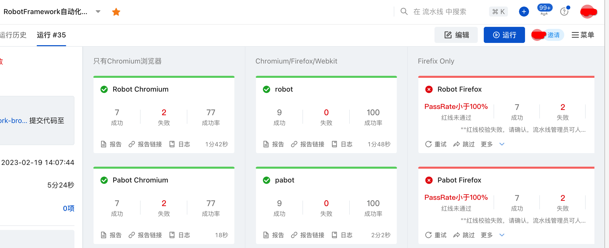
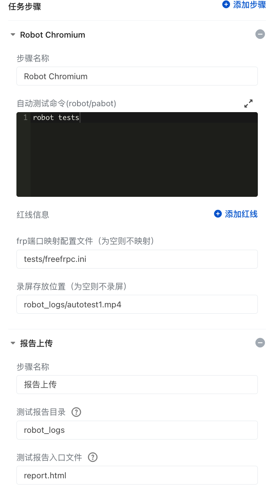

# 使用说明  
基于RobotFramework Browser自动化测试自定义云效飞流流水线步骤。  
    需要：  
    1. 使用飞流flow工具发布一个自定义步骤  
       1. 修改flow-tmpl/step.yaml之sign  
       2. ./flow login    
       3. ./flow publish      
    2. 新建流水线，添加新发布的步骤，添加报告上传
    3. 支持RobotFramework Browser、requests，支持测试录屏，支持实时vnc接入查看执行过程  
## 上传报告  
需要自己添加上传报告步骤，报告路径 robot_logs, 文件名 report.html  

## 测试命令  
```
robot testfolder
```
或者
```
pabot testfolder
```
testfolder 为测试文件的路径，参照tests目录。  

## 效果图  

## 配置图  


## vnc实时查看执行过程  
需要一个frp服务器，参照robotframework-browser/templates新建frp服务器和nginx  
参照robotframework-browser/templates/frpc.tmpl.ini创建frp客户端配置文件，放到工作路径并配置参数  
或者使用freefrp.net提供的免费frp穿透服务。参照tests/freefrpc.ini，修改subdomain和custom_domains，并在域名服务器配置cname或hosts文件里加上域名映射。`144.24.68.60 test.yourdomain.com`  
# 参考文档  
## 云效自建测试自动化最佳实践
https://help.aliyun.com/document_detail/224585.html  
## 云效流水线自定义步骤  
https://help.aliyun.com/document_detail/153811.html?spm=a2cl9.flow_devops2020_goldlog_detail.0.0.45f146f6321yVX  
## 阿里云容器镜像服务  
https://cr.console.aliyun.com/cn-beijing/instances  
## 内网穿透frp  
https://github.com/fatedier/frp  